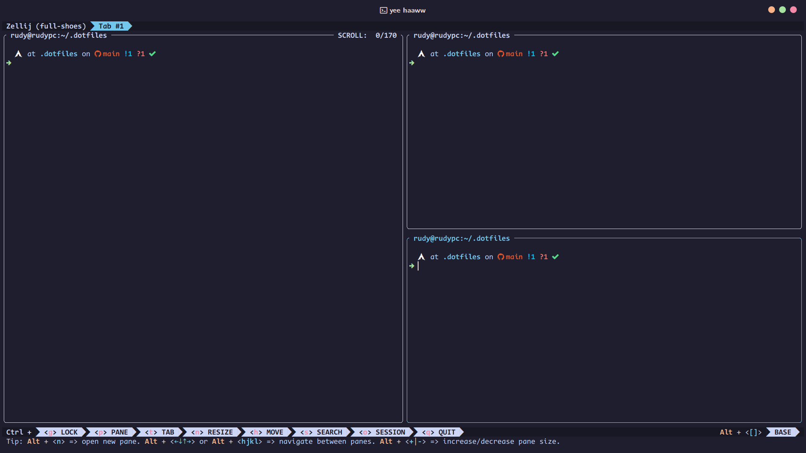
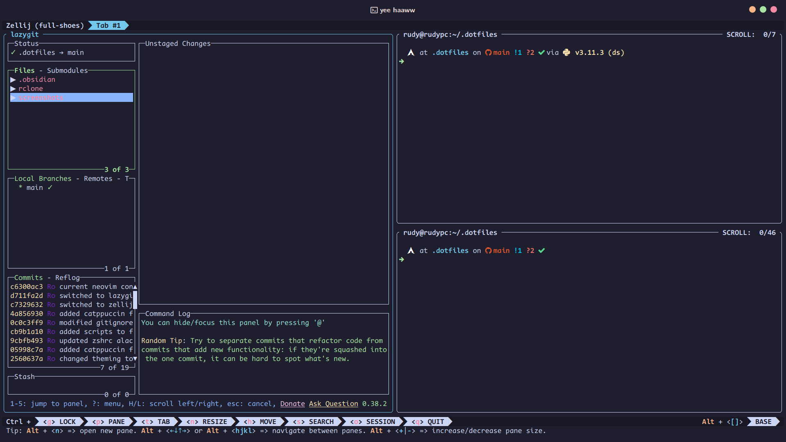
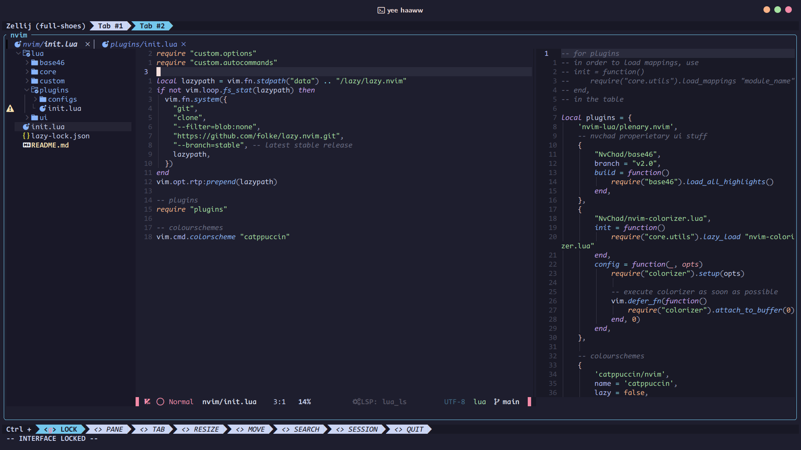
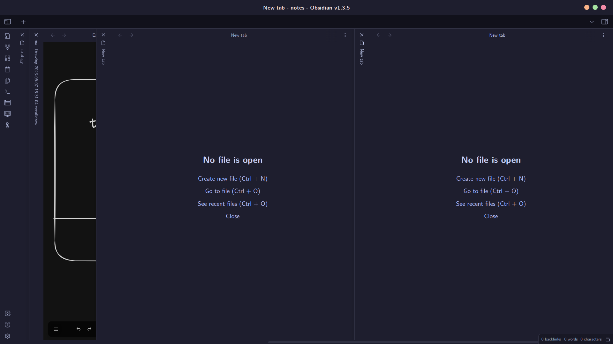
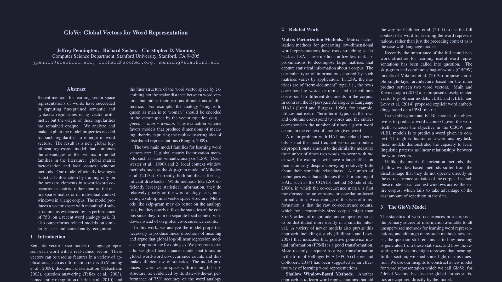

# My dotfiles

## Applications

### Primary

- **Terminal**: [Alacritty](https://github.com/alacritty/alacritty)
- **Shell**: [Zsh](https://www.zsh.org/)
- **Prompt**: [Starship](https://github.com/starship/starship)
- **Terminal multiplexer**: [Zellij](https://github.com/zellij-org/zellij)
- **Text editor**: [Neovim](https://github.com/neovim/neovim)
- **PDF viewer**: [Zathura](https://github.com/pwmt/zathura)
- **Notes**: [Obsidian](https://obsidian.md/)

### Secondary

- [exa](https://github.com/ogham/exa)
- [zoxide](https://github.com/ajeetdsouza/zoxide)
- [lazygit](https://github.com/jesseduffield/lazygit)
- [htop](https://github.com/htop-dev/htop)
- [ncdu](https://github.com/rofl0r/ncdu)

### Colorschemes?

The best ever, [**Catppuccin (mocha)**](https://github.com/catppuccin/catppuccin)

## Example screenshots

- Alacritty, Zellij and starship prompt

- Lazygit

- Neovim

- Obsidian

- Zathura

